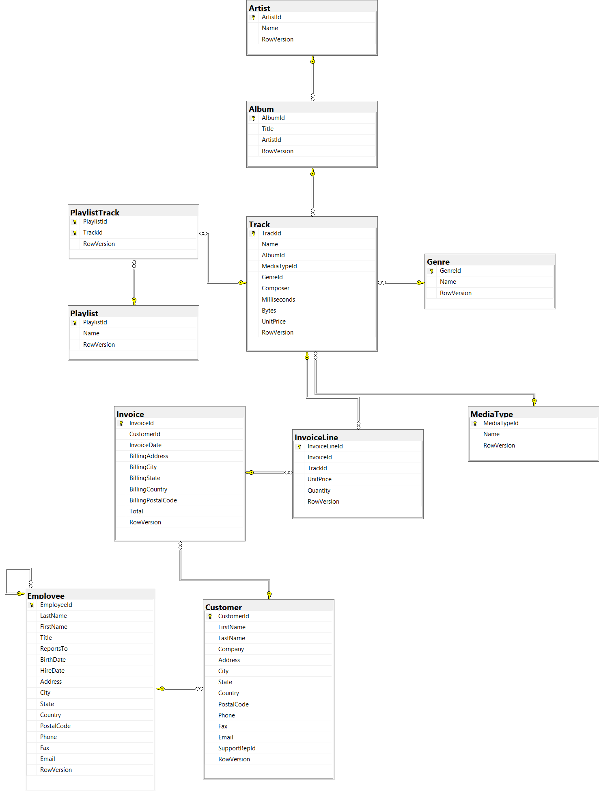

# 📚 Proyecto Chinook Data Warehouse

## Descripción
La base de datos Chinook es una base de datos de ejemplo que simula una tienda de música digital. Incluye información sobre artistas, álbumes, pistas, géneros, clientes, empleados y facturas.Viene con datos reales extraídos de una biblioteca de iTunes.

## Objetivo

Este proyecto tiene como objetivo:

1. **Implementar** una base de datos transaccional (**OLTP**) basada en el esquema de [Chinook Database](https://github.com/lerocha/chinook-database).
2. **Transformar** esa base de datos en un **Data Warehouse** optimizado para análisis y reporting, utilizando un diseño en **estrella** (*Star Schema*).

---

## 🔷 Fases del Proyecto

### 1. Construcción del modelo OLTP

- Crear la base de datos **Chinook** siguiendo la estructura oficial.
- Crear todas las tablas, restricciones y relaciones (Primary Keys, Foreign Keys).
- Poblar inicialmente la base de datos con los datos de ejemplo proporcionados.

**Principales entidades:**
- Customer
- Invoice
- InvoiceLine
- Employee
- Artist
- Album
- Track
- Genre
- MediaType
- Playlist
- PlaylistTrack

### 2. Diseño del Data Warehouse

- Crear un esquema estrella (**Star Schema**) basado en la operación principal: **Ventas**.
- Diseñar una **tabla de hechos** (`FactInvoice`) y **tablas de dimensiones** (`DimCustomer`, `DimEmployee`, `DimTrack`, `DimDate`).
- Crear un proceso de extracción, transformación y carga (**ETL**) para mover datos desde el modelo OLTP al Data Warehouse.

---
## 📁 Estructura del proyecto

```plaintext
/ChinookOLTP
    /dbo
        /Tables

/ChinookDW
    /dbo
        /Tables
    /staging
        /Tables
```
---
## 📊 Diagrama General OLTP
---

---
## 🛠 Tecnologías utilizadas

- **SQL Server 2022**
- **Visual Studio 2022** (SQL Server Database Project)
- **SQL Server Management Studio (SSMS)**

---

## 📄 Créditos

Basado en el proyecto [Chinook Database](https://github.com/lerocha/chinook-database) de **Leandro Rocha**.